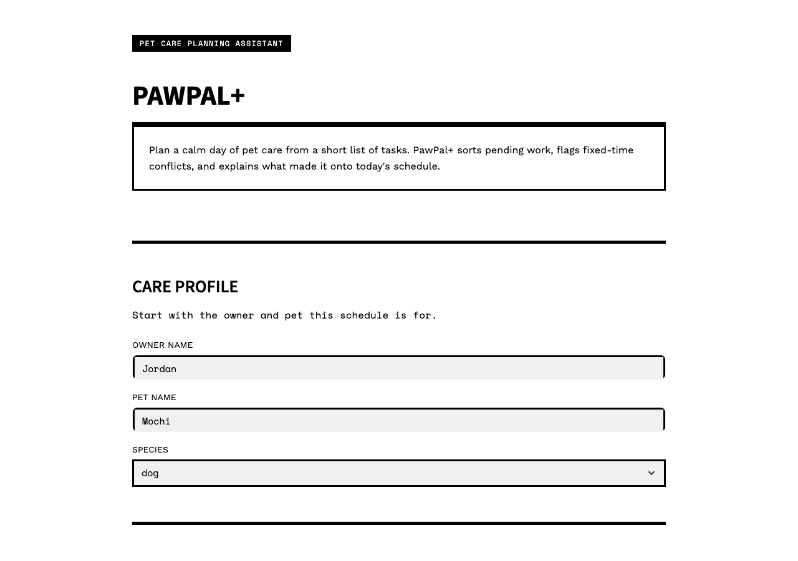
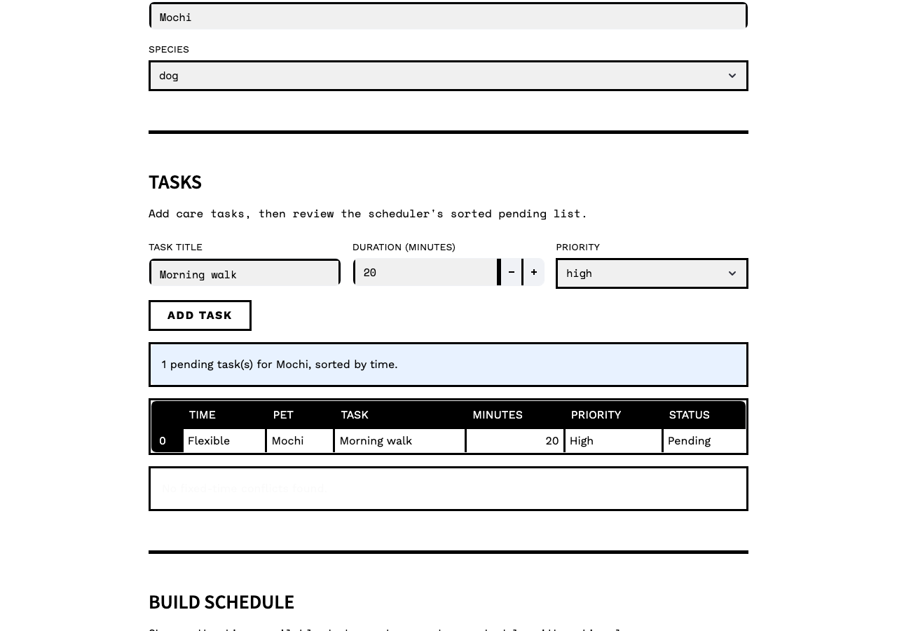
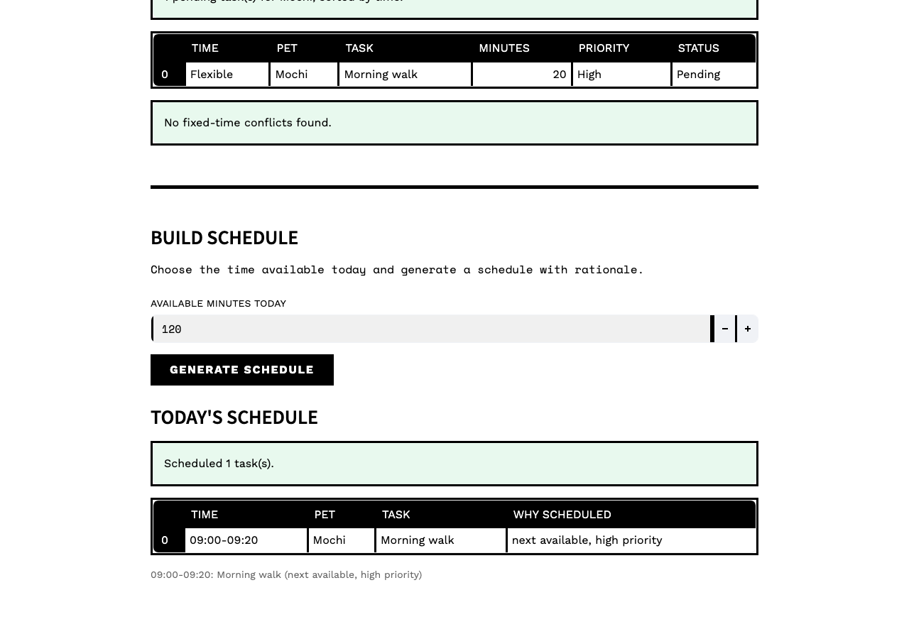
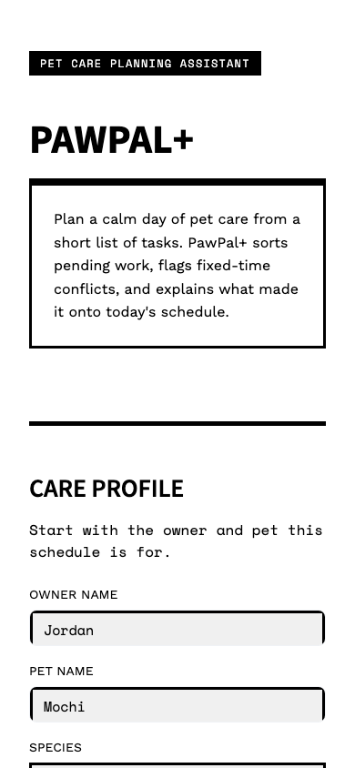

# PawPal+ (Module 2 Project)

You are building **PawPal+**, a Streamlit app that helps a pet owner plan care tasks for their pet.

## Scenario

A busy pet owner needs help staying consistent with pet care. They want an assistant that can:

- Track pet care tasks (walks, feeding, meds, enrichment, grooming, etc.)
- Consider constraints (time available, priority, owner preferences)
- Produce a daily plan and explain why it chose that plan

Your job is to design the system first (UML), then implement the logic in Python, then connect it to the Streamlit UI.

## What you will build

Your final app should:

- Let a user enter basic owner + pet info
- Let a user add/edit tasks (duration + priority at minimum)
- Generate a daily schedule/plan based on constraints and priorities
- Display the plan clearly (and ideally explain the reasoning)
- Include tests for the most important scheduling behaviors

## Getting started

### Setup

```bash
python -m venv .venv
source .venv/bin/activate  # Windows: .venv\Scripts\activate
pip install -r requirements.txt
```

### Suggested workflow

1. Read the scenario carefully and identify requirements and edge cases.
2. Draft a UML diagram (classes, attributes, methods, relationships).
3. Convert UML into Python class stubs (no logic yet).
4. Implement scheduling logic in small increments.
5. Add tests to verify key behaviors.
6. Connect your logic to the Streamlit UI in `app.py`.
7. Refine UML so it matches what you actually built.

## 🖥️ Sample Output

```
Today's Schedule
- Nina: 08:00-08:20: Breakfast (fixed start)
- Nina: 09:00-09:30: Walk (fixed start)
- Milo: 10:30-10:45: Brush (fixed start)
```

## Testing PawPal+

```bash
python -m pytest
```

## Demo Walkthrough

1. Open the Streamlit app and review the RawBlock-styled PawPal+ screen.
2. Enter the owner name, pet name, and species in **Care Profile**.
3. Add a task by entering a task title, duration in minutes, and priority, then click **Add task**.
4. Review the pending task table. The app uses `Scheduler.filter_tasks()` to show the selected pet's pending tasks and `Scheduler.sort_by_time()` to display them in schedule order.
5. Check the status messages above and below the task table. The app uses `st.success()` when tasks are sorted or no conflicts are found, and `st.warning()` for fixed-time conflicts.
6. Enter the available minutes for the day and click **Generate schedule**.
7. Review **Today's Schedule**, which is displayed as a table with time range, pet, task, and rationale.
8. Review **Unscheduled** if it appears. Each skipped task includes the scheduler's reason, such as a time conflict or not enough available minutes.

Example workflow:

1. Add pet profile details for `Mochi`.
2. Add a high-priority task like `Morning walk` for 20 minutes.
3. Add more tasks with different priorities or fixed starts in code or the CLI demo.
4. Generate the schedule.
5. Confirm that sorted tasks, conflict warnings, and scheduled/unscheduled tables match the scheduler behavior.

Sample CLI output from `python main.py`:

```text
Tasks Sorted by Time
- 08:00: Nina Breakfast
- 09:00: Milo Quiet feeding
- 09:00: Nina Walk
- 10:30: Milo Brush
Nina Pending Tasks
- Walk (pending)
- Breakfast (pending)
Schedule Warnings
- Warning: 09:00 has overlapping tasks: Milo Quiet feeding, Nina Walk
Today's Schedule
- Nina: 08:00-08:20: Breakfast (fixed start, high priority)
- Milo: 09:00-09:15: Quiet feeding (fixed start, medium priority)
- Milo: 10:30-10:45: Brush (fixed start, low priority)
```

## Screenshots for Human Reviewers

RawBlock input form:



RawBlock task preview:



RawBlock generated schedule:



Mobile RawBlock layout:



## UML Diagrams

- Initial draft: [`diagrams/uml_draft.mmd`](diagrams/uml_draft.mmd)
- Current UML: [`diagrams/uml.mmd`](diagrams/uml.mmd)
- Final implementation diagram: [`diagrams/uml_final.mmd`](diagrams/uml_final.mmd)

## Project Files

- `app.py`: Streamlit user interface.
- `pawpal_system.py`: domain classes and scheduling logic.
- `main.py`: CLI demonstration of sorting, filtering, warnings, and plan generation.
- `tests/test_pawpal.py`: basic regression tests.
