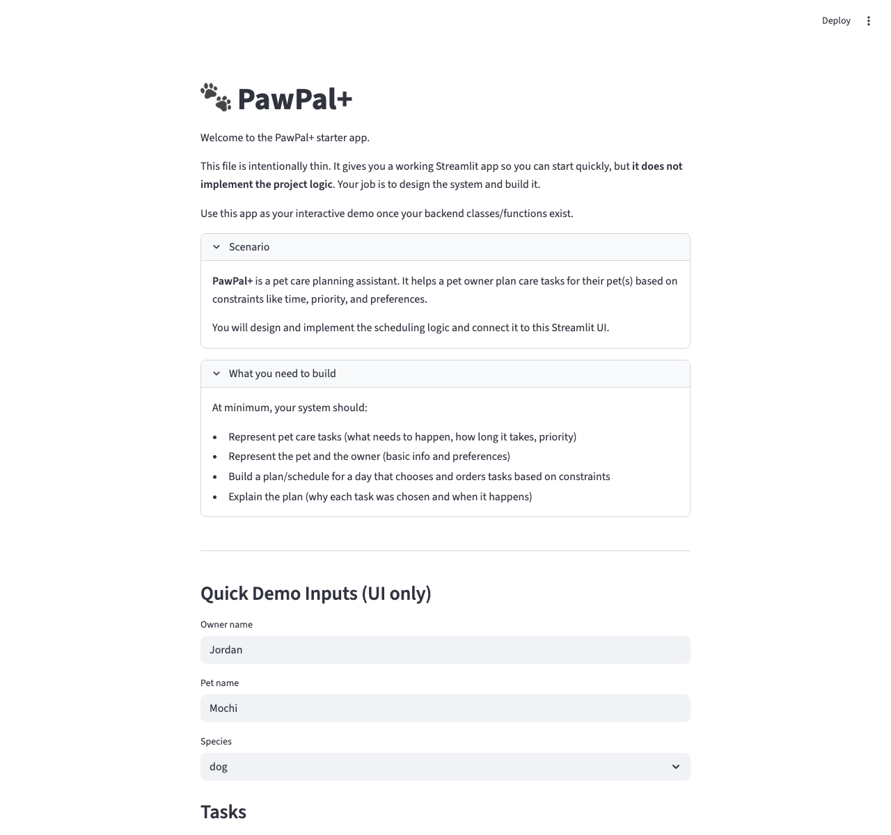
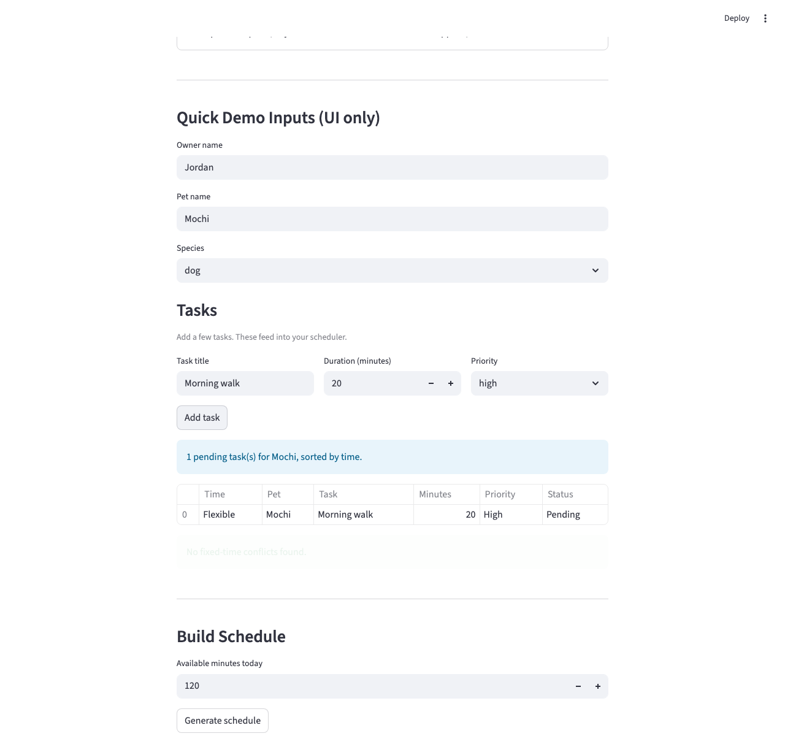
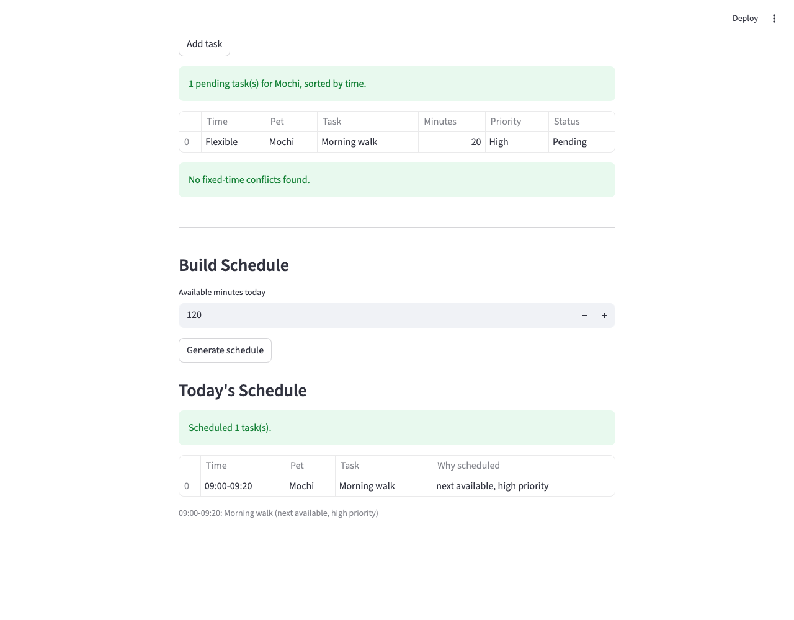

# PawPal+

PawPal+ is a Streamlit pet care planner. It lets an owner enter pet care tasks, preview pending tasks in sorted order, see conflict warnings, and generate a daily schedule with reasons for what was scheduled or skipped.

## Features

- **Owner and pet profiles**: enter an owner name, pet name, and species in the Streamlit app.
- **Task entry**: add care tasks with a title, duration, and priority.
- **Sorted task preview**: `Scheduler.sort_by_time()` orders fixed-time tasks by `HH:MM` and places flexible tasks last.
- **Filtered task display**: `Scheduler.filter_tasks()` shows pending tasks for the selected pet.
- **Conflict warnings**: `Scheduler.conflict_warnings()` warns when fixed-start tasks share the same time.
- **Daily schedule generation**: `Scheduler.build_daily_plan()` creates a time-bounded plan and keeps scheduled tasks in start-time order.
- **Priority-aware scheduling**: `Scheduler.prioritize_tasks()` ranks anchored tasks first, then priority, deadline, owner preference matches, and duration.
- **Conflict-safe placement**: `Scheduler.has_conflict()` and `ScheduleItem.overlaps()` prevent overlapping scheduled items.
- **Unscheduled explanations**: tasks that do not fit are saved as `UnscheduledTask` records with reasons such as conflicts or not enough available minutes.
- **Recurring task support**: `Task.mark_complete()`, `Task.next_occurrence()`, and `Scheduler.complete_task()` support daily and weekly recurrence.
- **Pet care constraints**: the scheduler can prevent food/exercise tasks from being too close together and can enforce an optional max-minutes-per-pet limit.

## Getting Started

```bash
python -m venv .venv
source .venv/bin/activate  # Windows: .venv\Scripts\activate
pip install -r requirements.txt
```

Run the Streamlit app:

```bash
streamlit run app.py
```

Run the command-line demo:

```bash
python main.py
```

Run tests:

```bash
pytest
```

## Demo Walkthrough

1. Open the Streamlit app and review the scenario and project requirements expanders.
2. Enter the owner name, pet name, and species in **Quick Demo Inputs**.
3. Add a task by entering a task title, duration in minutes, and priority, then click **Add task**.
4. Review the pending task table. The app uses `Scheduler.filter_tasks()` to show the selected pet's pending tasks and `Scheduler.sort_by_time()` to display them in schedule order.
5. Check the status messages above and below the task table. The app uses `st.success()` when tasks are sorted or no conflicts are found, and `st.warning()` for fixed-time conflicts.
6. Enter the available minutes for the day and click **Generate schedule**.
7. Review **Today's Schedule**, which is displayed as a table with time range, pet, task, and rationale.
8. Review **Unscheduled** if it appears. Each skipped task includes the scheduler's reason, such as a time conflict or not enough available minutes.

Example workflow:

1. Add pet profile details for `Mochi`.
2. Add a high-priority task like `Morning walk` for 20 minutes.
3. Add more tasks with different priorities or fixed starts in code or the CLI demo.
4. Generate the schedule.
5. Confirm that sorted tasks, conflict warnings, and scheduled/unscheduled tables match the scheduler behavior.

Sample CLI output from `python main.py`:

```text
Tasks Sorted by Time
- 08:00: Nina Breakfast
- 09:00: Milo Quiet feeding
- 09:00: Nina Walk
- 10:30: Milo Brush
Nina Pending Tasks
- Walk (pending)
- Breakfast (pending)
Schedule Warnings
- Warning: 09:00 has overlapping tasks: Milo Quiet feeding, Nina Walk
Today's Schedule
- Nina: 08:00-08:20: Breakfast (fixed start, high priority)
- Milo: 09:00-09:15: Quiet feeding (fixed start, medium priority)
- Milo: 10:30-10:45: Brush (fixed start, low priority)
```

## Screenshots for Human Reviewers

Main input form:



Sorted task table and conflict status:



Generated schedule table:



## UML Diagrams

- Initial draft: [`diagrams/uml_draft.mmd`](diagrams/uml_draft.mmd)
- Current UML: [`diagrams/uml.mmd`](diagrams/uml.mmd)
- Final implementation diagram: [`diagrams/uml_final.mmd`](diagrams/uml_final.mmd)

## Project Files

- `app.py`: Streamlit user interface.
- `pawpal_system.py`: domain classes and scheduling logic.
- `main.py`: CLI demonstration of sorting, filtering, warnings, and plan generation.
- `tests/test_pawpal.py`: basic regression tests.
